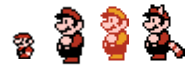

#슈퍼 마리오 3 포트폴리오
=================================
## 개요

#### 작업 인원
    김동평, 박세진 ,진세민

#### 구현 목표
    슈퍼마리오 3 구현(1 스테이지 중간보스까지)

#### 사용 엔진 및 언어
    유니티 3.20f1
    c# 

#### 역활
    * 김동평
      * 플레이어 (마리오)
    * 박세진
      * Enemy,FSM
    * 진세민
      * 게임 매니저, 맵 기믹 ,UI ,씬 구성

## 작업 진행

 #### 김동평
    
    
    
    1. 플레이어의 움직임을 구현
        * 이동 속도에 따른 애니메이션 구현 및 rigidbody를 이용한 가속도 구현이 된다.
        * 입력 시간에 따른 점프 높이를 다르게 조절할수 있도록 구현된다.
        * ForceMode2D.inpulse로 힘을 주었다.
    2.  아래키를 누르면 앉기를 구현
        * 콜라이더 사이즈가 애니메이션에 맞게 줄어든다.
        * 밑에 파이프가 있다면 RayCast감지 후 아래로 내려가는 애니메이션 출력된다.
            * 파이프로 이동시 애니매이션이 출력되고 이동후 다시 원래대로 돌아온다.
    3. Z키를 특수 능력을 이용
        * 일반 마리오 일때는 누르면 질주 이용이 가능하다.
        * 너구리 마리오는 꼬리치기로 공격 가능하다.
        * 불꽃 마리오는 불을 날릴수 있다.
    4. 플레이어와 오브젝트간의 상호작용 구현
        * BoxCollider2D 를 이용하여 아이템과 적을 구분된다.
        * 적과 충돌한다면 마리오 상태에 따라서 상태가 변경된다.
        * 상호작용이 가능한 아이템을 먹었을시 획득 및 아이템에 따라서 마리오 상태 변경된다.
    5. 애니매이션 
        * 이동속도에 따른 애니매이션을 다르게 나온다.
        * 마리오의 애니메이션을 뼈대로 각 마리오의 변신형태도 같은 변수를 통해 관리되도록 하였으며
            거기에 각 마리오의 특징에 맞는 특수능력에 맞는 애니메이션이 추가 되어있다.
    6. 기타 상호작용
        * 밟기는 RayCast를 통해 아래에 오브젝트를 확인후 적이라면 테그를 Player에서 Attack으로 변경후 
            공격하고 발쪽에 콜라이더가 활성화 되면서 점프가 된다
        * 언덕은 RayCast를 통해 언덕을 감지하여 기울기에 따라서 중력값과 마찰력을 조절하여 자연스럽게 
            올라가고 마리오가 멈췄을때 미끄러지지 않도록 rigidbody2d의 x값 freeze를 통해서 위치 
            고정하였고 오르막에서 점프할 경우 마리오 밑에 발판이 활성화 된다
        * 언덕에서 앉으면 미끄러지도록 만들었으며, 마리오의 테그가 Attack으로 전환되고 속도가 0에 가까워 지면  
            테그가 Player로 다시 전환된다
        * 노트 블럭을 위에서 아래로 밟을떄 RayCast로 감지 하고 충돌했을 경우 점프키를 누르면 더 높게 점프한다.
        * 마리오가 사망 할 경우 Timescale이 0 으로 변경이 된후 unscaledDeltaTime 으로 애니메이션을 진행 한다.
        * 너구리 마리오 상태일떄에 P가 끝까지 채워질때 점프키를 누르면 일정 사간동안 날수 있다.
        * 불꽃 마리오가 사용하는 불꽃은 RayCast를 통해서 바닥을 감지 하며 바닥에 출돌할 경우 addForce를 통해 
            이동하며 , 측면에 충돌하였을 경우 파괴가 된다.
        * 마리오가 Goal에 들어갔을경우 Time.Scale이 0이 되며 마리오의 상태는 Clear 상태로 변경이 되며 
            오른쪽 방향으로 이동이 되고 다른 키값을 받지 않는다.

#### 박세진
    * 이미지
    1. 적 공통 움직임
        * 움직이는 몬스터들은 FSM으로 구현 되어 있으며 기본적으로 3개의 상태가 있다.
            * Idle
                * 가장 기본적인 상태 이며 플레이어가 가까이 갈 경우에 Move로 상태가 전환된다.
            * Move
                * 기본적으로 좌우로 움직인다
                * Raycast 로 벽과 절벽을 인식하고 벽 혹은 절벽을 인식하면 잔행방향과 
                    반대 방향으로 전환된다.
                * 특정 몬스터에게 날개를 달면 다른 움직임을 보여준다.
            * dead
                * 마리오에게 공격 당했을 경우 나타나는 상태이며 스코어로 표시후 파괴가 된다
    2. 적 종류
        * 굼바
            * 굼바는 기본적인 클래스이며 기본적인 FSM 기능을 가지고 있다
            * 굼바에게 날개가 있다면 주기적으로 점프를 하면서 이동하며 마리오에게 공격 당했을 경우
                날개가 사라지며 Move 상태로 변경이 된다.
        * Tuttle 
            * 거북이는 가본클래스에서 상속 받으며 FSM에는 Shell,ShellMove가 추가 되었다.
            * 플레이어에게 밟혔을 경우 FSM은 Shell로 변경이 된다.
            * shell 상태에서 8초 동안 상호작용이 없다면 다시 Move 상태로 변경된다
            * Shell 상태에서 마리오와 충돌시 Shell은 MoveShell로 변경이 된다.
            * MoveShell 상태는 태그와 레이어가 분리 되어 있으며 Raycast로 벽과 오브젝트를 인식하며
               벽일경우 방향전환이 되고 아이템 상자 와 note 블럭에 충돌시 상호작용 하면서 방향이 전환된다
            * Tuttle에게 날개가 있을 경우 특정 위치에서 위아래로 움직이며 마리오에게 공격 당했을 경우
                날개가 사라지며 Move 상태로 변경이 된다.

        * FlowerEnemy(초록, 빨강)
            * 기존 적과 별개의 클래스로 구성 하였다.
            * 내려가있다가 플레이어가 거리안에 들어오면 올라오는 기능을 가지고 있다.
            * 내려가있을때는 BoxCollider를 비활성화해서 충돌을 무시한다.
            * 내려가있을때 토관 옆과 위에 BoxCast를 생성해서 플레이어가 토관에 붙어있는지 확인하고 
                붙어있다면 내려가있는 상태유지한다.
            * FlowerEnemy (빨강)일 경우 플레이어가 거리안에 들어오면 올라와서 4방향 중 근접한 
                방향에 불꽃공격 후 다시 내려간다.

        * boo(부매랑 몬스터)
            * 기본 적과 별개의 클래스로 구성 하였으며, 플레이어가 거리안에 들어오면 
                업데이트문을 통해서 좌우로 움직인다.
            * 항상 플레이어를 바라 보며, 사거리안에 플레이어가 들어온다면 1초주기로 부매랑을 던진다.
            * 몬스터가 던지는 부매랑은 오브젝트 풀링을 이용하였으며 최대 사거러까지 
                가면 bool값을 변경하여 다시 되돌아 온다.
            * 부매랑이 플레이어와 충돌시 부메랑은 삭제가 된다.

        * Boss
            * FSM으로 설정하여 Idle,Move,Attack,Hit,Dead로 구성되어 있다
                * 마리오가 일정 거리까지 온다면 Idle 에서 Move로 전환된다.
                * Move일 경우 플레이어를 쫒아다닌다.
                * Attack은 마리오에게 피격 당하거나 일정시간마다 변경 되며 Attack 상태일 경우 마리오에게
                    공격 당하지 않는다
                * 체력이 0이 되면 Dead상태가 되면 일정 시간후 TitleScene으로 씬변경이 된다.
        
    3. 기타 구현
        * Lava는 일정주기로 점프하며,점프하지않을때는 스프라이트,콜라이더 비활성화가 된다.
        * Dummy는스포너를 통해서 생성, 공전운동하도록 설정하였다.
        * MovingBlock(가시블럭) 초기위치와 내려왔을때의 위치를 저장하고 코루틴을 통해 움직이는 주기 설정
        * 굼바스포너:쿨타임에 따라서 굼바의 방향을 지정해서 Instantiate를 통해 소환하며 FlowerEnemy와 
            같이 플레이어가 토관에 붙어있는지 파악하고 BoxCast를 통해 붙어있으면 스폰하지않도록 제한한다.

#### 진세민
    * 이미지
    1. 게임 매니저
        * 게임 메니저는 싱글톤을 이용하여 시간, 목숨, 플레이어 상태 등을 저장한다.
        * 다음 씬으로 전환되어도 DontDestroyOnLoad를 이용하여서 다음씬으로 전환되어도 삭제가 안되도록 구현한다.
        * 씬에 따라서 GetActiveScene().name를 이용하여 Bgm을 변경한다.
    2. UI
        * UI 는 게임 매니저에게 값을 받아 시간, 포인트 목숨 , 보너스의 이미지를 출력을 한다.
        * UI에 나오는 모든 숫자는 이미지로 출력한다.
        * 시간은 0이 되면 플레이어가 사망 상태로 변경된다
        * 보너스는 Goal에 들어가면 한개씩 저장이 되면 3개가 모이면 추가 목슴을 준다.
        * 플레이어의 목숨이 없다면 게임 오버 화면으로 간다.
    3. 상호작용 오브젝트
        3-1. 코인
            * 코인은 BoxCollider2D를 이용하여 충돌하는 오브젝트를 인식한다
            * 마리오와 충돌하면 코인은 사라지고 게임 메니저에게 코인 +1을 전달한다.
        3-2. 블럭
            * 모든 블럭은 BoxCollider2D를 이용하여 충돌하는 오브젝트를 인식한다
            * 충돌한 오브젝트는 tag로 인식 후 플레이어 또는 MoveShell 이라면 안에있는 
                아이템 혹은 코인을 생성한다
            * 블럭은 활성화가 된후 파괴 혹은 비활성화 상태가 된다.
            3-2-1. 아이템 블럭
                * 아이템 블럭은 활성화가 되면 아이템 혹은 코인을 출력한다.
                * 아이템은 특정한 높이까지 올라간후 움직인다.
            3-2-2. 벽돌 블럭
                * 벽돌블럭은 충돌이 되면 tag에서 마리오인지 MoveShell 인지 인식한다
                * 만약 마리오라면 게임메니저에서 마리오의 상태를 가져온다
                * 작은 마리오 상태라면 MoveTowards를 이용하여 잠깐 위로 올라간후 아래로 내려간다.
                * 작은 마리오 상태가 아니라면 코인이 나오거나 파괴 애니메이션이 나오고 삭제가 된다.
            3-3-3. 노트 블럭
                * 노트 블럭은 파괴되지 않으며 활성화가 되면 MoveTowards를 이용하여 위 아래로 움직인다.
                * 마리오가 위에서 아래로 밟을때 아이템이 있는 블럭이라면 아이템이 밑으로 떨어진다.
                * 마리오가 위에서 아래로 밟을때 타이밍을 맞춰서 점프를 하면 높게 뛸수 있다.
        3-3. 아이템
            * 아이템은 총 4개가 있으며 버섯, 꽃, 나뭇잎, 별이 있다
            * 아이템은 아이템 박스에서만 나오며 위 혹은 아래로 움직인 후 아이템이 움직인다.
            * 움직이는 아이템은 벽에 충돌하면 진행방향과 반대 방향으로 움직인다
            * 버섯은 Translate를 이용해서 좌우로 움직인다.
            * 나뭇잎은 처음 아이템이 나올때 높게 올라간후 Translate를 이용하여 좌우로 움직인다
            * 별은 ridy.velocity 이용하여 움직이며 OnCollisionEnter2D로 바닥을 인식하며 
                바닥을 인식하면 점프를 한다.
        3-4. Goal
            * Goal은 마리오와 충돌하면 위로 올라간후 SelectScene으로 넘어간다.
        3-5. DownPlatfrom
            * DownPlatfrom은 Platfrom과 Rigidbody2D를 이용하여 만들었으며 마리오가 밟을때 떨어진다.
        3-6 파이프
            * 파이프는 마리오가 밑으로 내려갈때 Time.Scale을 0으로 만든후 이동하며 이동을 하면 
                다시 Time.Scale을 1로 전환한다.
            * 파이프로 이동을 하면 카메라가 고정이 되며 다시 이동을 하면 카메라가 원래대로 돌아간다.
    4. 카메라
        * 카메라는 일정 높이 까지 올라가면 카메라는 마리오를 따라간다.
        * 특정 맵에서는 y값이 고정이 되거나 아니면 자동으로 카메라가 x축으로 이동을 한다.
        
        

        
